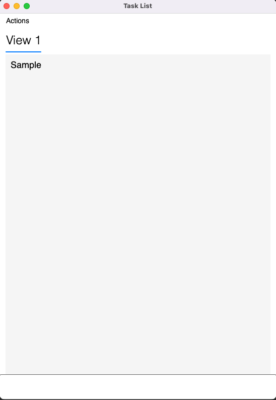

# ReactView

ReactView is a framework for building react.js based UIs that can be hosted in Avalonia/WPF applications.
Using this framework you can build .NET desktop applications that run on Windows or macOS (using the Avalonia version) and mix TypeScript and .NET code in the same app in a seamless way.

## Documentation

This is a fork within a simpler version of the [Sample.Avalonia](Sample.Avalonia), focused in the Sample Avalonia cs project only and consuming ReactView related dependencies through packages. That way it can be used as a boiler plate for simple tests.

  

## Getting Started
* You need to have .NET SDK installed with at least version 6 to properly use this boilerplate.

1) To build/run, just run the dotnet run or dotnet build commands in the repository root. Alternativaly, open the project solution in your IDE of Choice and hit run
1) Follow [these](ViewGenerator/readme.txt "Instructions") intructions if you want to create new views.
3) For more details check the Sample project.

## ReactView Releases
Stable binaries are released on NuGet, and contain everything you need to start creating ReactView based apps.
- 
- 
- 

# View Generator

ViewGenerator is the companion tool of the ReactView framework which generates the C# code from the TypeScript declarations and is responsible for compiling and packing all the application assets into the app bundle.

## Build pre-requisites
- NodeJS
- .NET 8+

## ViewPacker

We have a node package, _**node-sass**_ which creates a folder of vendors for each OS. However, to generate these vendors, the following command needs to run in each OS:
Inside ViewPacker with node_modules installed, the user should run `node scripts/install.js` which will generate a new vendor folder inside `node_modules/node_sass/vendor/` for the user's selected OS. This new vendor folder (e.g. `darwin-x64-72/`) and its **binding.node** content file shall then be added to ViewPacker's `build/node-sass-vendors/`.

For now we are using the following node versions:
- 10.16.3
- 12.18.4

**Note:** If you wish to upgrade the node version at use, don't forget to delete/replace any previous bindings related to the OS (`darwin-x64-72/` represents node 12.X.X's version).

# TODO
- Improve documentation
